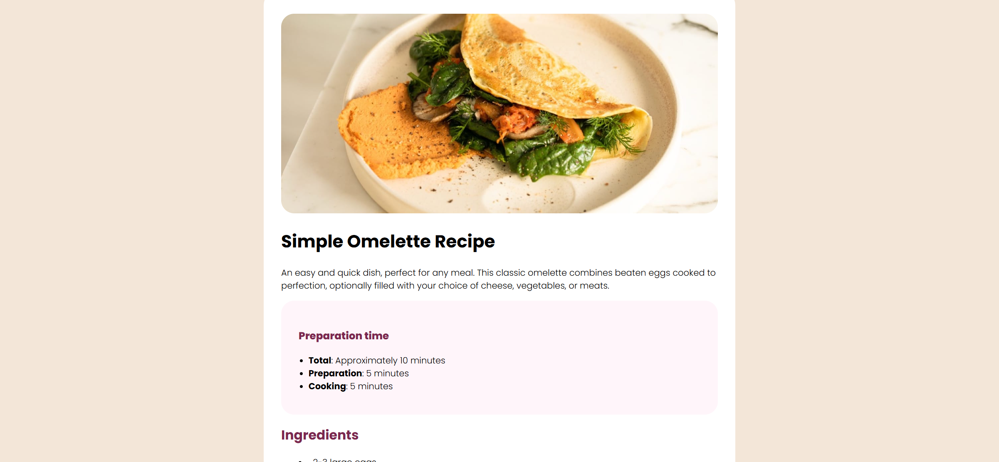

# Frontend Mentor - Recipe page solution

This is a solution to the [Recipe page challenge on Frontend Mentor](https://www.frontendmentor.io/challenges/recipe-page-KiTsR8QQKm). Frontend Mentor challenges help you improve your coding skills by building realistic projects. 

## Overview

### Screenshot

### Links

- Solution URL: [Click](https://id024.github.io/frontend-04)

### Built with

- Semantic HTML5 markup
- CSS custom properties
- Flexbox

### What I learned

Learned how to make website responsive and made it fit into mobile screen 

### Continued development

Need to play more with em, rem and other rescaling units

## Author

- Website - MriD
- Frontend Mentor - [@iD024](https://www.frontendmentor.io/profile/iD024)